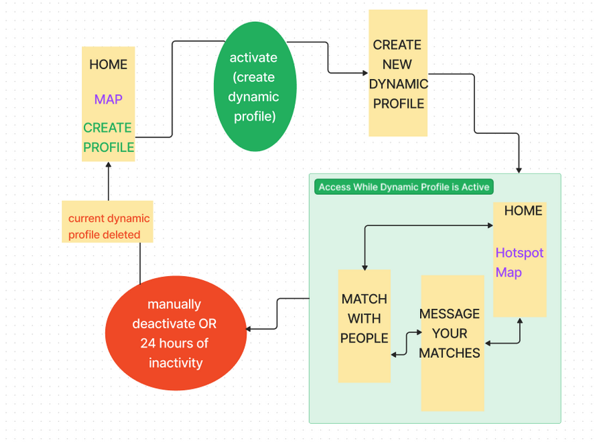
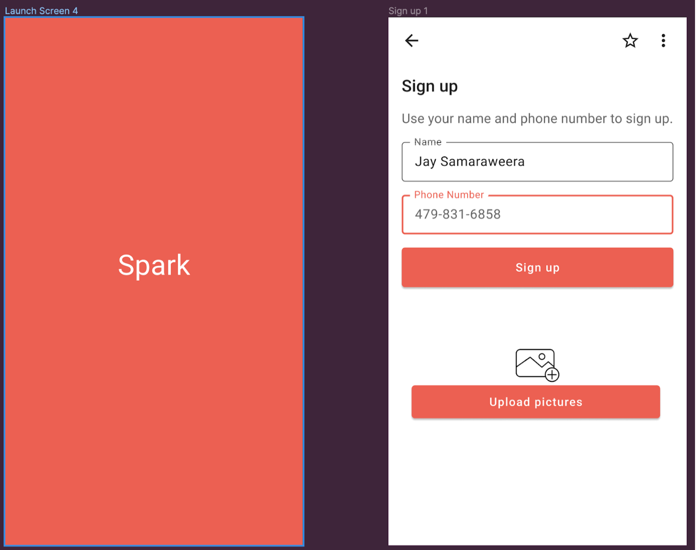
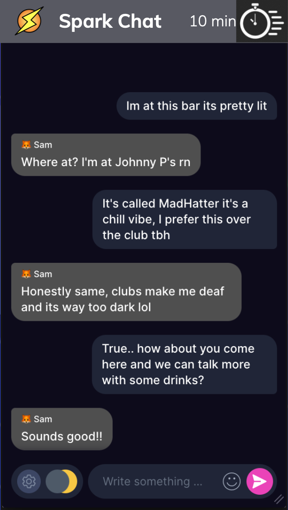
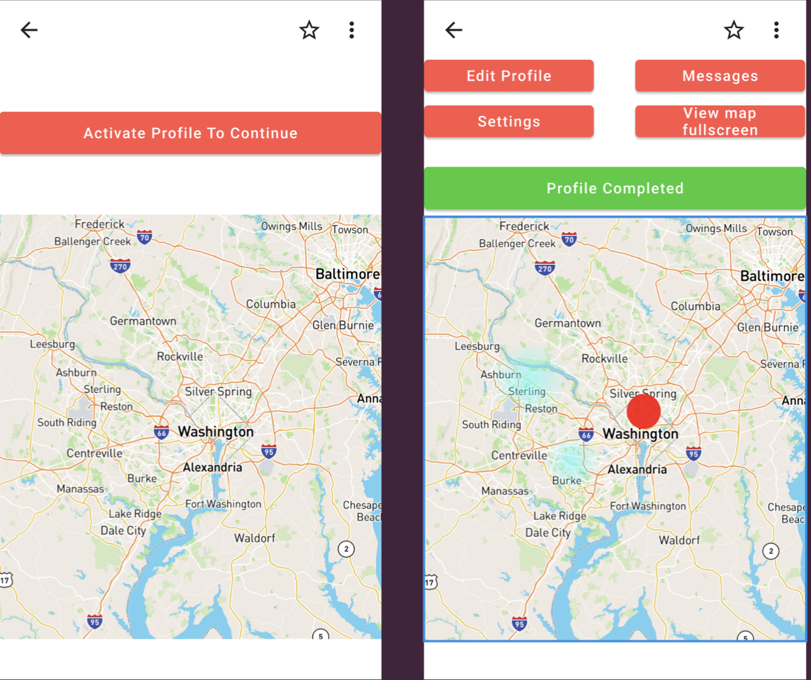
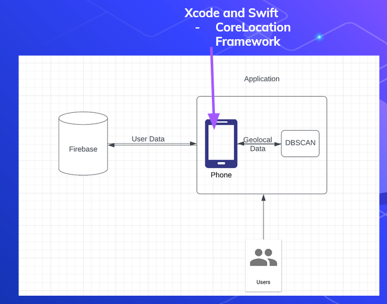

# Capstone-Design-Spark

<b>Spark Website</b>

Alex Kazaglis, Jose Duran, Jay Samaraweera

Have you ever listlessly swiped through Tinder, hoping one of those many matches will message you back? Or gone to a bar and left after half an hour, feeling too awkward to approach anyone there? If so, you’re not alone. When using Tinder, only about 2% of matches tend to result in an in-person meetup [1], and everyone knows the anxiety of trying to approach someone attractive in-person. Clearly, dating needs innovation - and with our app Spark, we intend to deliver some.

Spark is a dating app with a novel twist - a focus on hyperlocality. On Spark, you’ll only be able to see the profiles of people 1 mile away at maximum, meaning that you’d already be within walking distance of anyone you match with! While traditional dating apps generally have a feature to allow you to control the distance between you and the people you match with, their intention is for you to talk for a while with the person on the app and maybe, eventually make the move to meet up. They want you to stay on the app for longer periods of time, instead of meeting up with people and making genuine connections. Spark doesn’t work like that. We want users to make connections in real life, so we’ve cut out the middleman of having to arrange a time and place. Since you and your match are already in the same place due to the hyperlocality of the app, you no longer have to arrange anything, making it much easier to meet up! While hyperlocality is a wonderful feature, a user could run into the issue of ending up in a place where no other users are, rendering the app obsolete. To solve this problem, we’ll be using the concept of a hotspot. This will manifest as a map on the app’s home screen, showing a user where other users are concentrated at any given time. Our hotspots will take into account each users’ preferences of age, type of location, gender, and more, showing them the places where the majority of users relevant to them are, and provide the best opportunities of meeting that special someone.  

Of course, hyperlocal matching won’t be the only feature helping to keep our users in the moment and meeting people. Your profile on Spark will consist of two different parts - a static profile, and a dynamic one. The static profile will be your typical dating app profile, with your name, interests, and some photographs. The dynamic profile is meant to be updated every time you go out - once a day, when you want to access others’ profiles, you’ll have to take a selfie, so the people looking at your profile have the most up to date information on who they’re talking to. We also intend to implement a limit on how long you can message someone once you’ve matched, to further encourage spending more time in the real world and less time on your phone. 

Spark is useful just simply for dating purposes, and we intend it to be used by young people who are looking for a casual date that may turn into something more. However, its concept has the potential to greatly impact the culture of dating itself. Currently, going out can be very stressful for women, as they end up constantly being hit on by men even if they’re just out to have fun with friends. Spark would enable those men to find women in the area broadcasting that they’re open to a relationship through the app (instead of bothering random girls in a club) - both helping the men to find the girl of their dreams, and helping women to have a much less stressful experience. Spark also has the potential to make life much easier for LGBTQ people who want to meet people in real life instead of just talking on dating apps. Many LGBTQ people are afraid to approach someone they find attractive in person, as there are very real fears of being insulted or even attacked for it. Through Spark, one could find someone they know shares their gender preferences through the app and then immediately go out for a drink, removing that danger and improving quality of life for LGBTQ people.

Spark will be implemented with a hotspot algorithm that will be able to determine users’ locations and show other active users the current clumps of users that are out around DC. The functionality will depend on a large user count to create these hotspots based on their preferences time of the week. In addition to only allowing people to match on the basis of proximity (one mile), users will only be able to see the other profiles if they have created and updated their dynamic profile. This profile will consist of a picture taken that day and some simple questions to recommend hotspots for that given occasion. Another difference from other competitors is the messaging feature, since users will only be able to message for twenty minutes and then the match will disappear. 
Spark will be written in the Swift user interface through Xcode on Macs, Firebase will be the database backend, Google maps SDK for IOS will be used to generate an updated map with the hotspots and popular locations, and Github will be utilized to collaborate with my other teammates to commit and check code as a collective. This application is realistic and do-able since there are many models of dating apps that our team could look at for inspiration and implementation. The development cost for this project is virtually none, since we can research Swift and IOS applications online and look at copies of other dating apps to see how they worked. Since there are thousands of open-source applications online, we do not have to pay for programs and any tutorials on creating our project.Spark would be very successful financially since we could partner with bars and nightclubs to promote their locations as part of our hotspots. 
In conclusion, Spark has massive potential to help people make romantic connections in real life instead of relying on traditional dating apps, while reducing much of the anxiety and even perceived danger that comes with trying to meet people in person. We hope you’ll see as much value in our project as we do, and support our efforts to help people to find happiness outside of their phones
Grøntvedt, T. V., Bendixen, M., Botnen, E. O., & Kennair, L. E. O. (2020). Hook, line and sinker: do tinder matches and meet ups lead to one-night stands?. Evolutionary Psychological Science, 6(2), 109-118.

Product Specifications

User Stories:

As a User, I want to be able to see a map of hotspots upon opening the app, so I can see whether there are a lot of people out tonight or not.

As a User, I want to be able to create a dynamic profile, so I can see others’ profiles and they can see mine.

As a User, after I’ve created my dynamic profile, I want to see a new map of hotspots that takes into account the preferences from my dynamic profile, so I can see where to go based on what I want out of my day/night. 

As a User, I want to be able to customize my preferred size of the hotspots, so I can further use this information to decide where to go. 

As a User, I want to be able to view profiles of people who match my preferences and are within one mile, so I can possibly match with them.

As a User, I want to be able to message people whose profiles I match with, so we can possibly meet up in real life.

As a User, I want my dynamic profile to automatically be deleted after 24 hours of inactivity, to preserve the in-the-moment nature of the app.

Flow Diagram:

Launch and Dynamic Profile Screens:

Messaging:

Homescreen Before and After Profile Registration:

Architecture/System Diagrams: 

External APIs and Frameworks

Firebase API
Goal:
Store users and geolocal data in the form of coordinates
Description:
This API is used in the main Xcode file. It connects to the main algorithm (DBSCAN) functionality and is called when user locations are mapped. The parameters X,Y coordinates are retrieved via a call to the database.
Endpoints Used:
READ: ref.getData()
WRITE: ref.updateChildValues(childUpdate)

CoreLocation Framework
Goal:
Display and update user location on map
Description:
This framework is used in our Xcode project. It connects to the firebase database in which it receives and updates the user location on a real-time basis. The parameters of latitude and longitude are passed through functions like the CLLocationCoordinate function to display the user as a blue dot on MapKit.

Xcode/Swift
Goal:
Develop the app in an iOS environment
Description:
Xcode is a development environment created by Apple for iOS development, and Swift is the language specifically for use with Xcode to create iOS apps. Xcode allows one to both implement Swift code and create a UI for the app. 

Algorithms
DBSCAN
Goal: Group users on a map to create heatmap/hotspots for other users to view areas of popularity in terms of their preferences.

Description: We are going to have a Swift implementation of the DBSCAN (Density-based Spatial of Applications with Noise) Clustering algorithm, where we will set up the Epsilon and MinPoints variables to our desired values for testing users’ locations to create clusters. Once this algorithm is called, it will iterate to go through every point on the grid (map) and determine possible clusters based on the specified parameters and which points will be disregarded as the noise, or points that will not be part of any usable cluster. 

Epsilon variable: Radius of the point being tested in regard to its neighbors to see if other points are capable of being in the same cluster.

MinPoints variable: The minimum numbers of points in the same epsilon range that will constitute the creation of a cluster.

